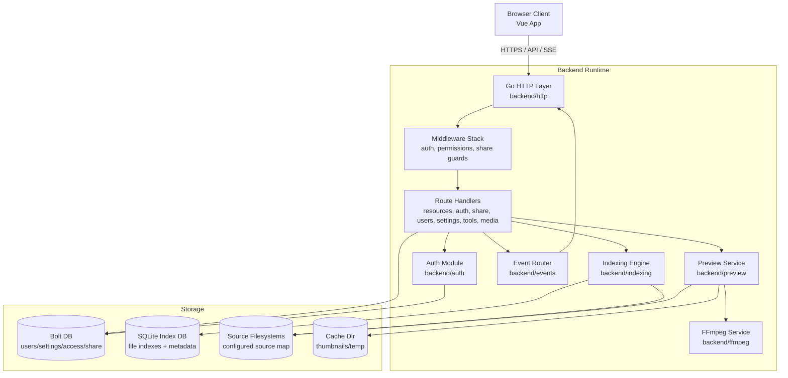
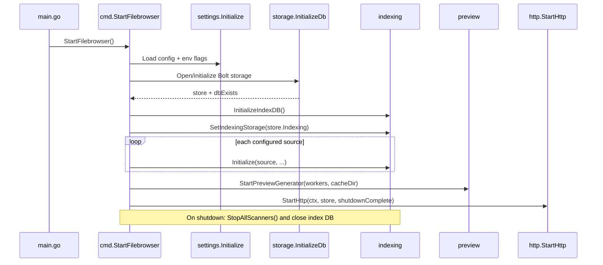
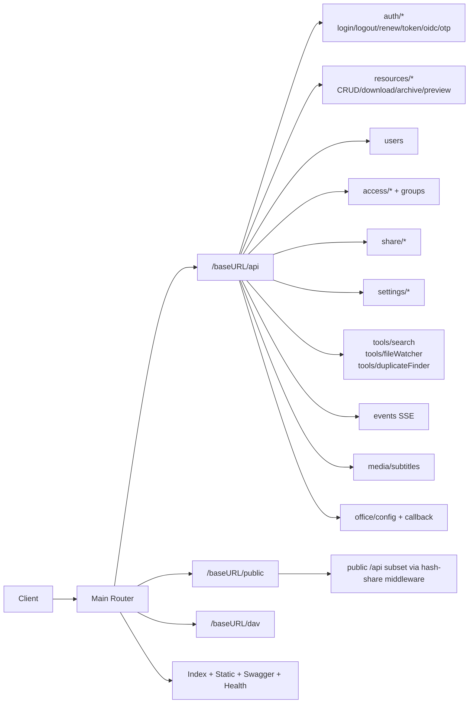
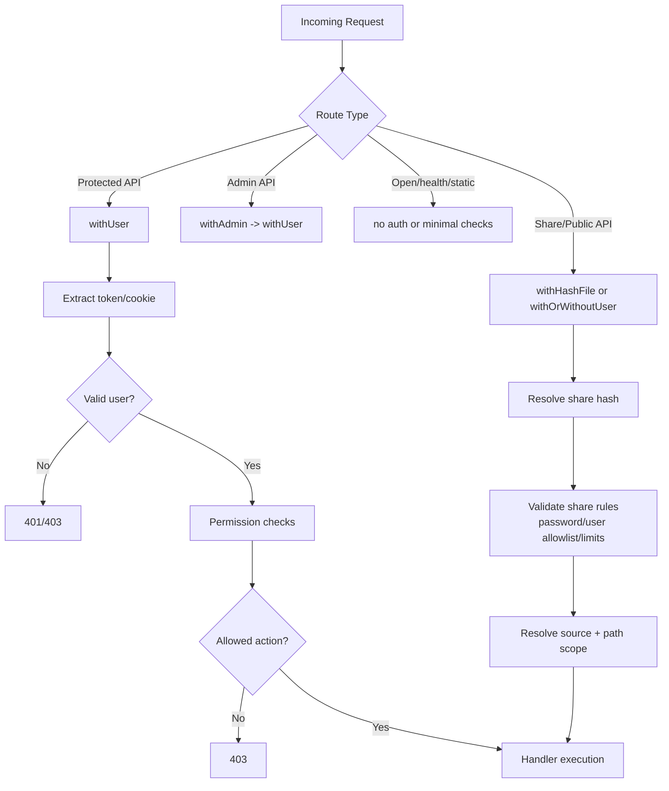
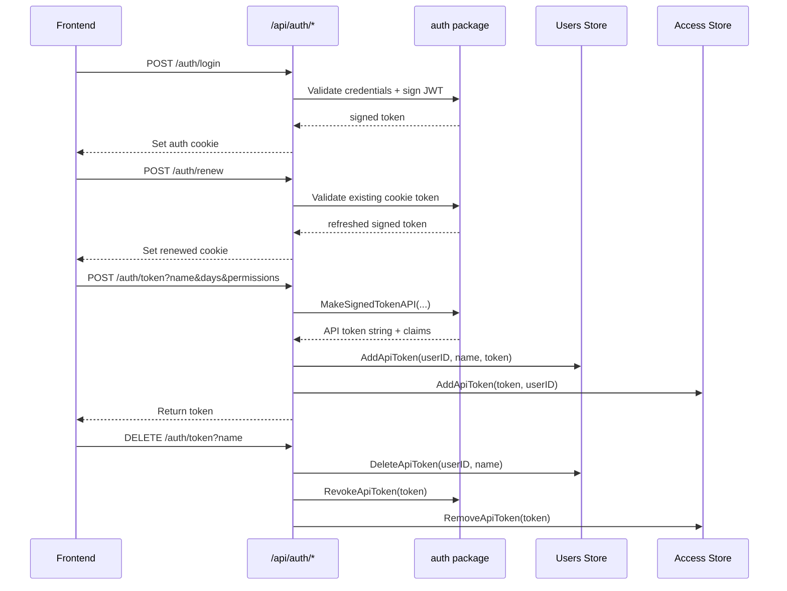
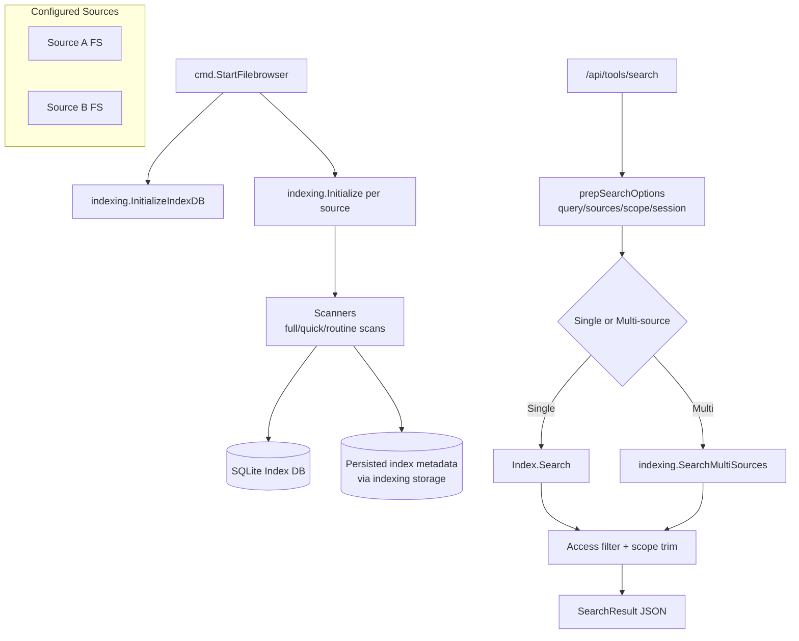
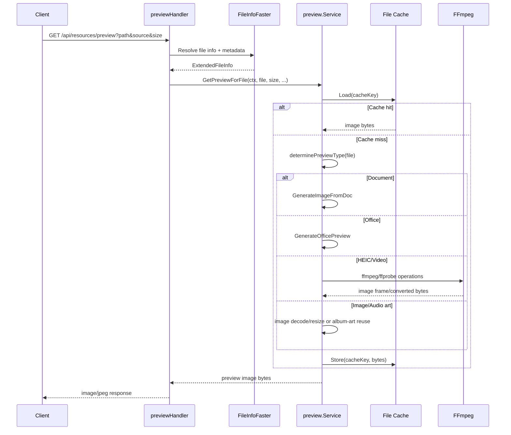
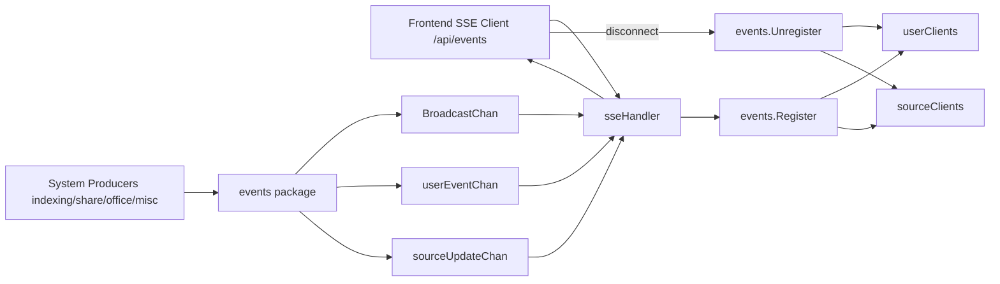
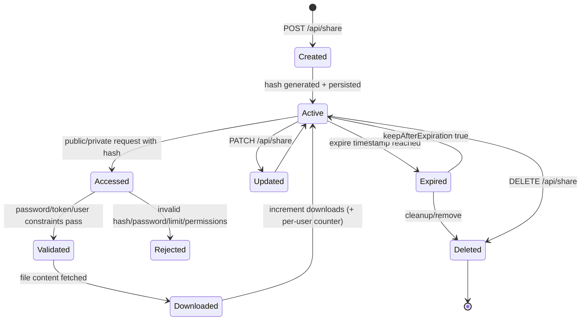
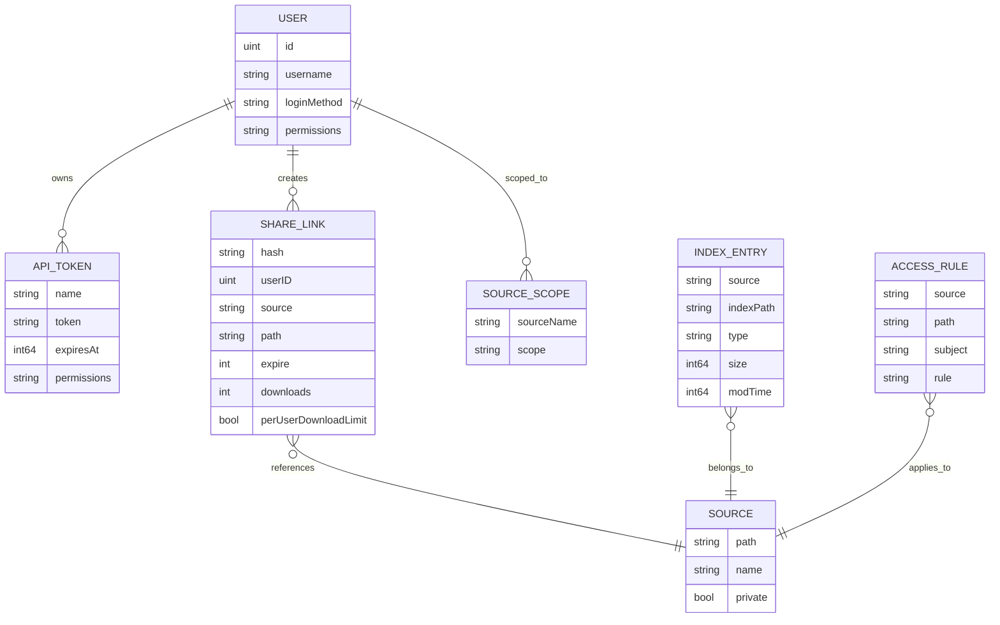

# FileBrowser Quantum Mermaid Diagrams

This file contains a comprehensive set of Mermaid diagrams derived from the current repository structure and backend/frontend flow.

## 1) High-Level System Architecture

## 2) Startup and Service Lifecycle

## 3) HTTP Router Map

## 4) Middleware and Auth Decision Flow

## 5) Login, Token Renewal, and API Token Lifecycle

## 6) Indexing and Search Data Flow

## 7) Preview Generation Pipeline

## 8) Realtime Events and SSE

## 9) Share Link Lifecycle

## 10) Storage Model (Conceptual ER)

